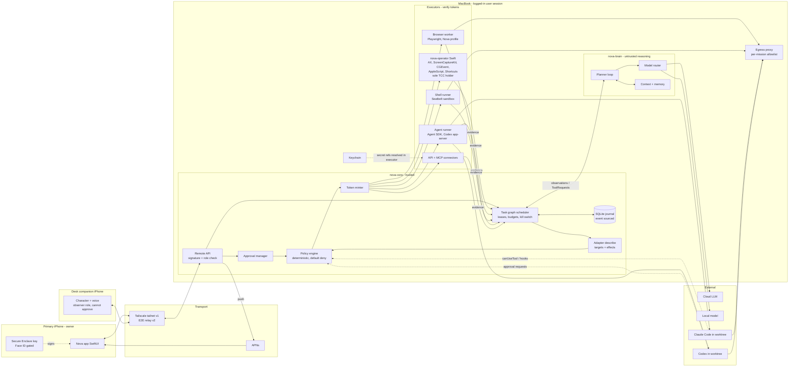

# System architecture

The phone signs, Core decides, and only token-bearing executors touch the Mac.

```mermaid
flowchart LR
  subgraph Phone["Primary iPhone - owner"]
    UI["Nova app SwiftUI"]
    SE["Secure Enclave key<br/>Face ID gated"]
  end
  subgraph Desk["Desk companion iPhone"]
    DC["Character + voice<br/>observer role, cannot approve"]
  end
  subgraph Net["Transport"]
    TS["Tailscale tailnet v1<br/>E2E relay v2"]
    APNS["APNs"]
  end
  subgraph Mac["MacBook - logged-in user session"]
    subgraph CoreP["nova-core - trusted"]
      API["Remote API<br/>signature + role check"]
      APR["Approval manager"]
      POL["Policy engine<br/>deterministic, default deny"]
      SCH["Task graph scheduler<br/>leases, budgets, kill switch"]
      JRN[("SQLite journal<br/>event sourced")]
      MINT["Token minter"]
      ADP["Adapter describe<br/>targets + effects"]
    end
    subgraph BrainP["nova-brain - untrusted reasoning"]
      PLN["Planner loop"]
      MR["Model router"]
      CTX["Context + memory"]
    end
    subgraph Exec["Executors - verify tokens"]
      OP["nova-operator Swift<br/>AX, ScreenCaptureKit, CGEvent,<br/>AppleScript, Shortcuts<br/>sole TCC holder"]
      BR["Browser worker<br/>Playwright, Nova profile"]
      AR["Agent runner<br/>Agent SDK, Codex app-server"]
      SH["Shell runner<br/>Seatbelt sandbox"]
      CN["API + MCP connectors"]
    end
    EG["Egress proxy<br/>per-mission allowlist"]
    KC["Keychain"]
  end
  subgraph Ext["External"]
    LLM["Cloud LLM"]
    LOC["Local model"]
    CC["Claude Code in worktree"]
    CX["Codex in worktree"]
  end

  SE -. signs .-> UI
  UI <--> TS
  DC <--> TS
  TS <--> API
  API --> APR
  API --> SCH
  APR --> POL
  SCH <--> JRN
  SCH <-- "observations / ToolRequests" --> PLN
  PLN --> MR
  MR --> LLM
  MR --> LOC
  PLN <--> CTX
  SCH --> ADP
  ADP --> POL
  POL --> MINT
  MINT --> OP
  MINT --> BR
  MINT --> AR
  MINT --> SH
  MINT --> CN
  AR --> CC
  AR --> CX
  CC -. "canUseTool / hooks" .-> POL
  CX -. "approval requests" .-> POL
  BR --> EG
  SH --> EG
  CC --> EG
  CX --> EG
  KC -. "secret refs resolved in executor" .-> CN
  OP -- evidence --> SCH
  BR -- evidence --> SCH
  AR -- evidence --> SCH
  SH -- evidence --> SCH
  CN -- evidence --> SCH
  API -- push --> APNS
  APNS --> UI
```
